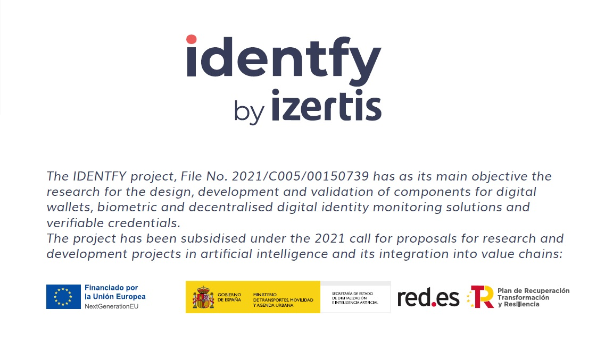
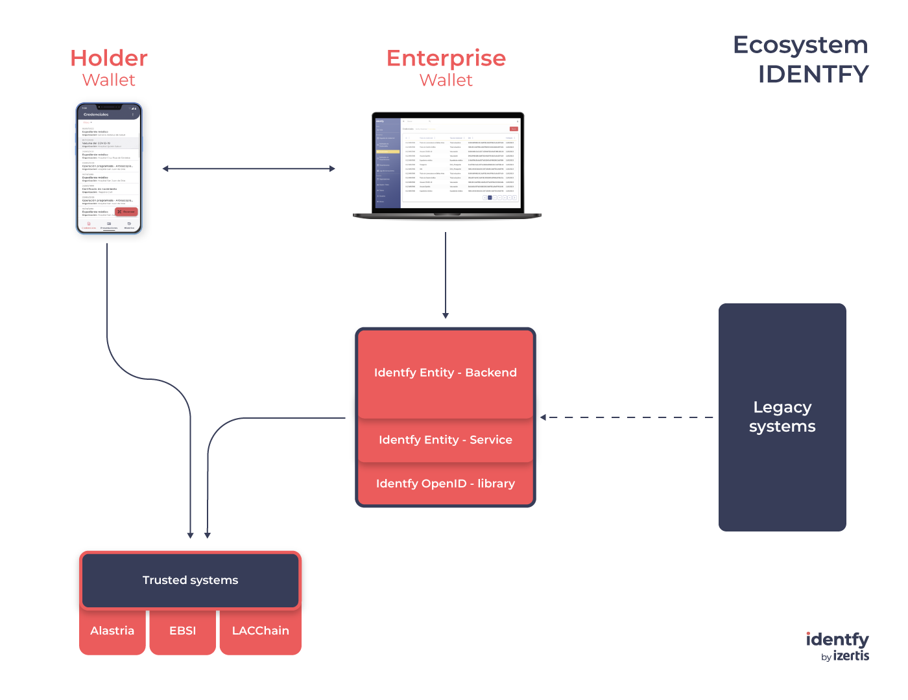

<p align="center">
    <picture>
      
    </picture>
</p>

<p align="center">
  <h4>
    An all-in-one solution to take control of your digital identity
  </h4>
</p>

<br/>

# identfy by Izertis
## Table of content:

- [Ecosystem](#ecosystem)
- [User Story](#user-story)
- [Start up the Enterprise Wallet](#)
- [Technological overview](#technological-overview)
- [Demostration](#how-it-works)
- [License](#license)
- [Trademark](#trademark)


## Ecosystem
identfy is a combination of various products that enable the user-centric solutions. identfy is an implementation of the Self-sovereig identity (SSI) approach based on the standards defined by the W3C for Verifiable Credentials (VC) and Decentralized Identifiers (DID). Based on those standars identfy implements:
- **Holder**: we provide a non-custodial Wallet which is available at [Holder Wallet](https://github.com/izertis/identfy-holder-wallet).
- **Issuer** and **Verifier**: both of them are entities so, we provide for them an **Enterprise Wallet** composed by the following components:
  - [identfy Entity backend](https://github.com/izertis/identfy-entity-backend) An administration platform for managing your entity's configuration.
  - [identfy Entity service](https://github.com/izertis/identfy-entity-service) A microservice that provides an interface for the Entity manager and executes most of the operative.
  - [identfy OpenID library](https://github.com/izertis/identfy-OpenID-library) A library that implements OpenID protocolos: OpenID4VCI and OpenID4VP.
- **Verifiable Data Registry**: we use Trusted Lists or Distributed Ledger Technology DLT / Blockchain networks.


<p align="center">
    <picture>
      
    </picture>
</p>

## User Story

Following, there are listed the main functionalities that can be executed at identfy - we are working on it so, currently some of them are not implemented:
- Onboarding of Entities and Holders: the generation of cryptographic keys and DIDs.
- Request a Credential to an Issuer and receive the Verifiable Credential.
- Issuance of Verifiable Credentials
- Share a Credential with a Verifier.
- Verify Credentials presented by a Holder.


## Start up an Enterprise Wallet instance

The required files to start up a Enterprise Wallet instance are located at the [docker](/docker/) folder. At that folder you can find the following files:
 - .env.example: a configuration file where you have to introduce the PUBLIC_URL that you will use for your Enterprise Wallet. If you want to start up it locally, you can introduce the *localhost* value. You have to rename or copy this file as .env
 - docker-compose.yaml: the configuration file required to start up the Enterprise Wallet.

Once you have a file **.env** where you have defined the URL for your Enterprise Wallet, the next step is executing the following commands.
```bash
cd docker
docker compose build
docker compose up
```
Once you have executed this command, you will have an instance of your Enterprise Wallet running.


## Technological overview

You can read about the technical specification at [Tech Overview](./docs/IDENTFY_TECH_OVERVIEW.md)


## How it works

You can find some **screenshots** of identfy components at the [demostration](./docs/IDENTFY_DEMOSTRATION.md) document. Also, you have a complete demostration video there.


# License
This software is dual-licensed; you can choose between the terms of the [Affero GNU General Public License version 3 (AGPL-3.0)](./LICENSES/agpl-3.0.txt) or a [commercial license](./LICENSES/commercial.txt). Look at [LICENSE](./LICENSE.md) file for more information.


# Trademark
**identfy** and its logo are registered trademarks of [Izertis](https://www.izertis.com)
