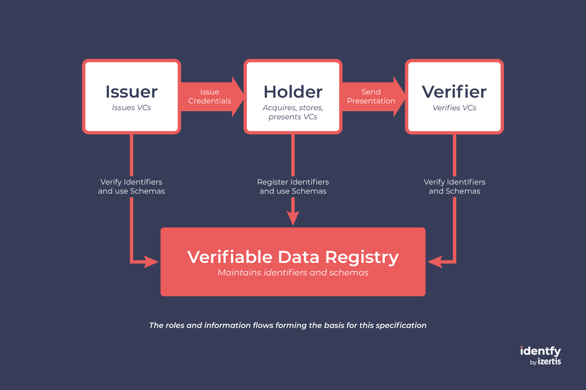

    <picture>
      <source media="(prefers-color-scheme: dark)" srcset="./img/identfy-logo-dark.svg">
      <source media="(prefers-color-scheme: light)" srcset="./img/identfy-logo-light.svg">
      
    </picture>

  <h4>
    An all-in-one solution to take control of your digital identity
  </h4>

 

# identfy by Izertis - Technological overview
## Table of content:

- [Architecture](#architecture)
- [Technology](#technology)
- [Is it my solution compatible?](#compatibility-and-prerequisites)
- [Resources used to build the identfy](#references)

## Architecture

As an implementation of the SSI, the architecture of identfy is composed by an Issuer, a Holder, a Verifier and the verifiable data registry.

    <picture>
      
    </picture>

## Technology

identfy aims to be a set of components that enable working against many digital identity systems. Currently, we are working to support EBSI in its last version, LACChain ID framework and Alastria 3.0. Those three digital identity models are an implementation of SSI.

Following, there are listed the used technology:
 - [W3C VC](https://www.w3.org/TR/vc-data-model/)
 - [DID](https://www.w3.org/TR/did-core/)
 - [JWT](https://www.rfc-editor.org/info/rfc7519)
 - [ECDSA](https://www.rfc-editor.org/rfc/rfc6979)
 - [OpenID4VCI](https://openid.net/specs/openid-4-verifiable-credential-issuance-1_0.html) and [OpenID4VP](https://openid.net/specs/openid-4-verifiable-presentations-1_0.html)
 - [DIDComm](https://identity.foundation/didcomm-messaging/spec/)

## Compatibility, Prerequisites and integration

If you would like to be compatible with identfy, you should take in consideration the documentation and specification of each component. Currently, there are supported some data models and signature algorithms. We are working to provide a boarder and more complete implementation.

On the other hand, identfy is designed to connect and retrieve data from legacy systems. For that, you should provide an endpoint that could be invoked by the identfy Enterprise Wallet

If you require additional information or support, you can contact us sending an email to blockchain@izertis.com

## References

Following, there are listed the main resource used to build identfy:
 - [EBSI](https://hub.ebsi.eu/)
 - [Alastria EPIC](https://github.com/alastria/AlastriaEPIC)
 - [LACChain GitHub](https://github.com/lacchain)